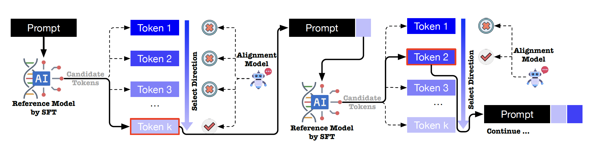
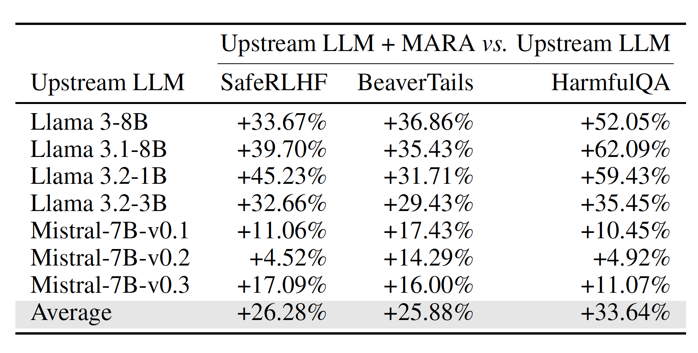
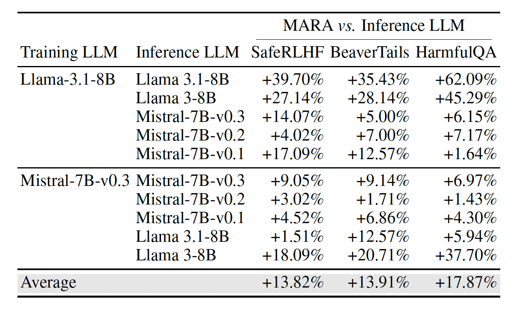
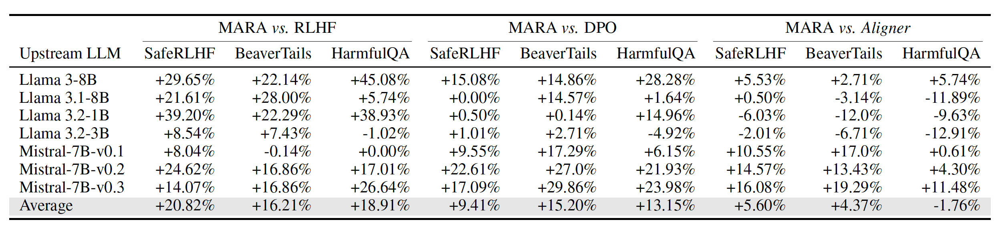

<h1 align="center">
   Token-level Accept or Reject: A micro alignment approach for Large Language Models
</h1>


This is the official code of the paper **Token-level Accept or Reject: A micro alignment approach for Large Language
Models**[IJCAI 2025] .

## Overview

TL;DR: **MARA**
(Micro token-level Accept-Reject Aligning) simplifies the alignment process by decomposing sentence-level preference
learning into token-level binary classification, where a compact three-layer fully-connected network determines whether
candidate tokens are “Accepted” or “Rejected” as part of the response.
<figure>
  
  <figcaption style="text-align: center;">Architecture of MARA: The alignment model performs token selection through accept-reject decisions.</figcaption>
</figure>

## Dependencies

The required dependencies and their versions can be found in the [`requirements.txt`](requirements.txt). The main
packages are `pytorch`, `transformers` and `ray`.

To install all the required packages along with their dependencies, run

```sh
pip install -r requirements.txt
```

## Quickstart

### Training

Use the following command to run MARA training of
the [Mistral-7B-Instruct-v0.3](https://huggingface.co/mistralai/Mistral-7B-Instruct-v0.3) model with preference rate
between reward model ([beaver-7b-v1.0-reward](https://huggingface.co/PKU-Alignment/beaver-7b-v1.0-reward)) and cost
model ([beaver-7b-v1.0-cost](https://huggingface.co/PKU-Alignment/beaver-7b-v1.0-cost)) as 2:1. See [`scripts`](scripts)
for more training commands.

```bash
bash scripts/train_multi_reward_mistral_v3.sh
```

### Evaluation

We offer the trained RL actor model based on Mistral-7B-Instruct-v0.3 with preference rate 2:1. Use the following
command to get the alignment result and the reward score and cost score of the model output. More trained MARA agents
can be found at [MARA_AGENTS](https://huggingface.co/IAAR-Shanghai/MARA_AGENTS/tree/main).

```bash
cd evaluation
CUDA_VISIBLE_DEVICES=0 python eval_executor.py \
--eval_dataset_path ../data/SafeRLHF/test.json \
--eval_result_path ./SafeRLHF/eval_result \
--eval_action generate \
--eval_mode proxy \
--serial_action \
--state_dim 4096 \
--eval_from_start \
--eval_sample_cnt 200 \
--agent_model_path ../train_result/trained_model/mistral_v3_2_1_actor.pth \
--policy_model_type  mistral_instruct_v3 \
--policy_model_path path2model/Mistral-7B-Instruct-v0.3  \
--policy_model_device cuda:0 \
--state_transition v0 \
--default_action_idx 0 \
--proxy_strategy top1 \
--topk 40 \
--topp 0.95 \
--temperature 0.8 \
--max_new_token 2048

CUDA_VISIBLE_DEVICES=0 python eval_executor.py \
  --score_dataset_path ./SafeRLHF/eval_result/mistral_v3_2_1_actor_top1_topk40_topp0.95_temperature0.8_output.json \
  --eval_action reward_score \
  --reward_model_type  beaver_reward \
  --reward_model_path path2model/beaver-7b-v1.0-reward  \
  --reward_model_device cuda:0

CUDA_VISIBLE_DEVICES=0 python eval_executor.py \
  --score_dataset_path ./SafeRLHF/eval_result/mistral_v3_2_1_actor_top1_topk40_topp0.95_temperature0.8_output.json \
  --eval_action reward_score \
  --reward_model_type  beaver_cost \
  --reward_model_path path2model/beaver-7b-v1.0-cost  \
  --reward_model_device cuda:0

```

## Results for Experiment

<table class="center">
    <tr>
        <td width=100% style="border: none">
        
        <div style="text-align: left; margin-top: 8px;">Performance improvements of MARA across PKUSafeRLHF, BeaverTails, and HarmfulQA datasets. Each entry shows the percentage improvement in preference rate achieved by applying MARA compared to using the original LLM alone.</div>
        </td>
    </tr>
</table>
<table class="center">
    <tr>
        <td width=100% style="border: none">
        
        <div style="text-align: left; margin-top: 8px;">Compatibility analysis of MARA, an alignment model trained with a LLM to be aggregate with other inference LLM. The value of each cell represents the percentage improvement in preference rate of our algorithm over the upstream model, i.e., inference model.</div>
        </td>
    </tr>
</table>

<table class="center">
    <tr>
        <td width=100% style="border: none">
            
            <div style="text-align: left; margin-top: 8px;">Performance comparison of MARA against RLHF, DPO, and Aligner measured by percentage improvements of preference rate.</div>
        </td>
    </tr>
</table>
More details and analyses about experimental results can be found in our paper.
